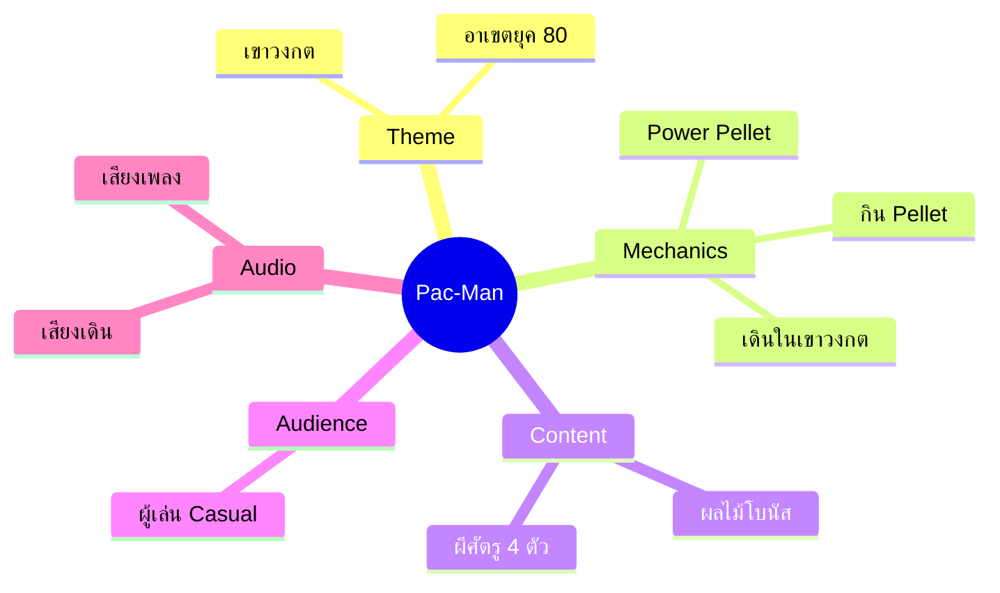
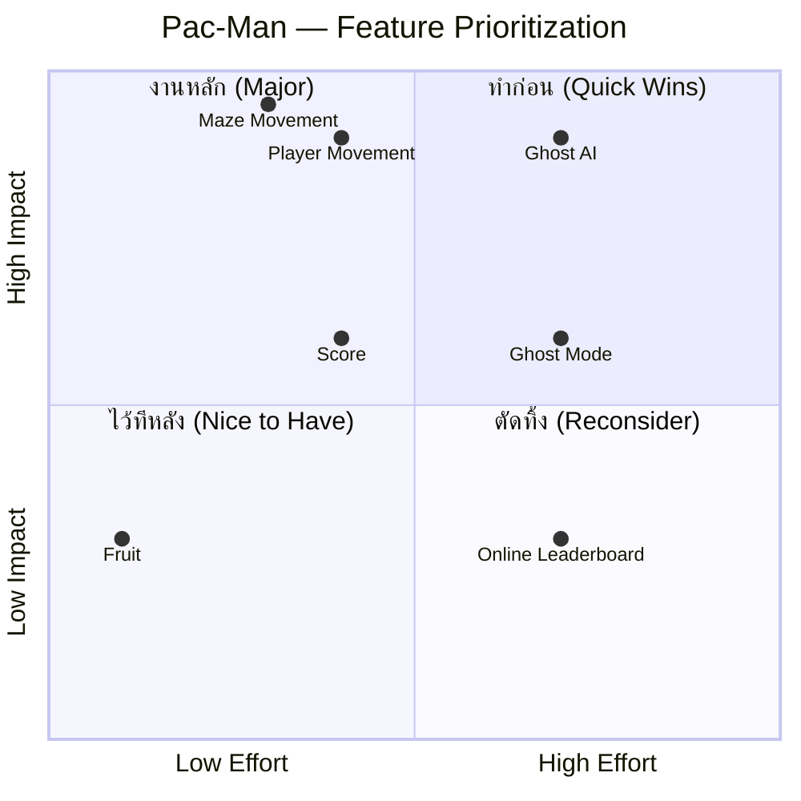
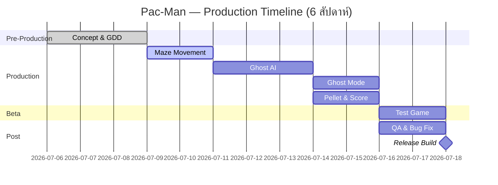

```mermaid
mindmap
  root((Pac-Man))
    Theme
     เขาวงกต
     อาเขตยุค 80
    Mechanics
     เดินในเขาวงกต
     กิน Pellet
     Power Pellet
   Content
     ผีศัตรู 4 ตัว
     ผลไม้โบนัส
   Audience
     ผู้เล่น Casual
   Audio
     เสียงเดิน
     เสียงเพลง
```

```mermaid
quadrantChart
    title Pac-Man — Feature Prioritization
    x-axis Low Effort --> High Effort
    y-axis Low Impact --> High Impact
    quadrant-1 "ทำก่อน (Quick Wins)"
    quadrant-2 "งานหลัก (Major)"
    quadrant-3 "ไว้ทีหลัง (Nice to Have)"
    quadrant-4 "ตัดทิ้ง (Reconsider)"
    Maze Movement: [0.3, 0.95]
    Ghost AI: [0.7, 0.9]
    Online Leaderboard: [0.7, 0.3]
    Player Movement: [0.4, 0.9]
    Score: [0.4, 0.6]
    Fruit: [0.1, 0.3]
    Ghost Mode: [0.7, 0.6]
```

## MVP Feature คือ Ghost AI

## Feature ที่ควรตัดออกก่อนคือ Fruit

```mermaid
gantt
title Pac-Man — Production Timeline (6 สัปดาห์)
dateFormat YYYY-MM-DD
section Pre-Production
Concept & GDD :done, c1, 2026-07-06, 3d
section Production
Maze Movement :active, p1, after c1, 2d
Ghost AI : p2, after p1, 3d
Ghost Mode : p3, after p2, 2d
Pellet & Score : p3, after p2, 2d
Section Beta
Test Game : p4, after p3, 2d
section Post
QA & Bug Fix : q1, after p3, 2d
Release Build :milestone, m1, after q1, 0d
```

